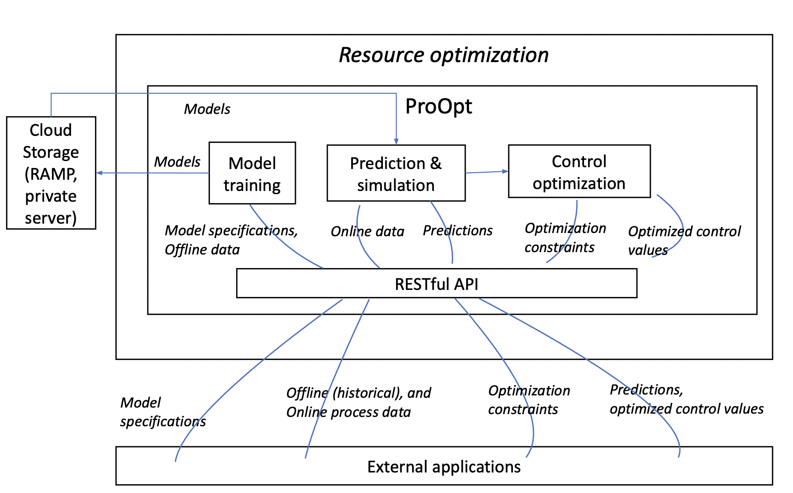

# Process Optimization

[](https://opensource.org/licenses/MIT)
[](https://hub.docker.com/r/<org>/<repo>/)
<br/>
[](https://github.com/ramp-eu/Process_Optimization
[](https://github.com/ramp-eu/TTE.project1/actions?query=workflow%3ACI)
[](https://coveralls.io/github/ramp-eu/TTE.project1?branch=master)
[](https://app.codacy.com/manual/jason-fox/TTE.project1)
[](https://bestpractices.coreinfrastructure.org/projects/4187)

## Contents

-   [Background](#background)
-   [Usage](#usage)
-   [API](#api)
-   [Testing](#testing)
-   [Feedback](#feedback)
-   [License](#license)

## Background

Process Optimisation performs process quality and efficiency optimisation using nonlinear model predictive control. The
system learns the dynamics of the production process, an then it can predict the process output quality metrics given
the current values for the control parameters. The user can also make simulated predictions about the key quality
indicators with alternative control parameter values, so as to seek for better control. The system can also find optimal
control values given the desired output quality and optimisation constraints, and can thus be used as an advisory tool
for the operator or as an autonomous closed-loop controller.

### Technical Architecture



ProOpt has three main functional modules and communicates with end-use applications through a RESTful API.

1. The model training module receives training dataset and model specification from external applications to run a
   training pipeline and results in predictive models. The models are stored in the RAMP storage for later use by other
   modules.

2. The Prediction & simulation module reads process data from external applications and returns the predictions made by
   the trained models. External applications can change process data and send the data to this module to simulate the
   target quality.

3. This Control optimization module is responsible for finding the optimal process setups to achieve the targeted
   quality. This module receives process data, the optimization constraints and the target quality from the external
   application and runs the optimization algorithm. The module returns the optimal values of the process parameters,
   together with the achieved quality

## Usage

0. Contact TDS and RAMP for granting access to private docker repo in RAMP (docker.ramp.eu)
1. Clone or copy folder `docker` to your local environment
2. Login to docker.ramp.eu through docker CLI
3. Modify `docker-compose.yml' to mount local folder for AI model storage after training
4. Exec `docker-compose up -d`

The API docs will be then accessible via `http://localhost:6543/api/v1.0/`. An example of API can also be replicated
using exported postman file `docker/ramp-TDS.postman_collection.json`.

Notes:

-   For tunning the training and optimization, please refer to documentations under `docs` folder.
-   For making requests to the API, please refer to this example in python, `docker/examples/main.py`.

```text
Definition of the API interface:

Information about the API can be found in the [API documentation](http://localhost:6543/api/v1.0/) of the running docker container; or `src/openapi.yaml`
```

## Feedback

Any feedback and suggestions can be submitted by creating `New issue` in the `Issues tab` or by emailing the development
team:

-   Hung Ta (hung.ta@topdatasience.com)
-   Juho Piironen (juho.piironen@topdatascience.com)
-   Duc Ta (duc.ta@topdatascience.com)

## License

[MIT](LICENSE) © <Top Data Science>
